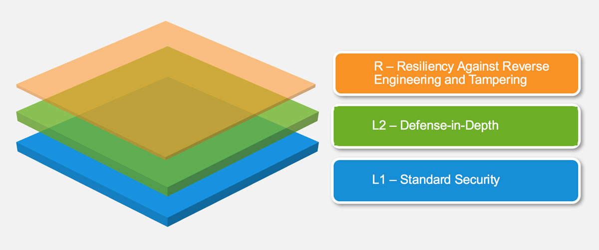

# モバイルアプリケーションセキュリティ検証標準(MASVS)

MASVSは、モバイルアプリケーションに関するセキュリティの信頼レベルを確立するために使用されます。本書で定義される事項は、下記項目を念頭に作成されました。

* 測定基準としての利用：既存のモバイルアプリケーションについて、その開発者及び所有者が対照できるようにセキュリティ標準を提供します。
* ガイダンスとしての利用：モバイルアプリケーション開発及びテストの全ての段階におけるガイダンスを提供します。
* 調達時の利用：モバイルアプリケーションを検証するためのベースラインを提供します。

## モバイルアプリセキュリティモデル

MASVSは２つの厳格なセキュリティレベル（L1及びL2）を定義します。また、リバースエンジニアリングへの耐性要件（MASVS-R）の組み合わせについても定義します。MASVS-Rは必要に応じて、アプリケーション特有の脅威モデルに対して適用することができます。MASVS-L1とMASVS-L2は包括的なセキュリティ要件を含み、かつ、全てのモバイルアプリケーション(L1)及び機密情報を取り扱うモバイルアプリケーション(L2)を対象としています。MASVS-Rは、クライアントサイドの脅威を防ぐことを目的とした設計における追加の防御策です。

MASVS-L1の要件を満たすことで、セキュリティのベストプラクティスを遵守し、一般的な脆弱性にさらされない安全なアプリケーションになります。
MASVS-L2はSSLピンニングのような追加の徹底した防御を加えます。その結果アプリケーションは、より高度な攻撃に対して弾性を持つようになります（モバイルOSのセキュリティ制御に問題がなく、かつエンドユーザが潜在的な攻撃者とみなされないと仮定した限りですが）。L1、L2の全てあるいは部分的に満たした場合、MASVS-Rにおけるソフトフェアの安全性要件は、エンドユーザが悪意を持っている、またはモバイルOSが脆弱であるといった場合における特定のクライアントサイドの脅威を防ぐことができます。

**MASVS-R及び『OWASP Mobile Testing Guide』に記載されているソフトフェア保護制御は、究極的には回避されるものであり、セキュリティ制御の代替となるものではないことに注意してください。代わりに、それらはMASVS-L1またはL2におけるMASVS要件を満たすアプリケーションに対して、特定の脅威に対しする追加的な防御の仕組みを付与します。**

図1:　セキュリティ検証レベル。MASVS-L1はほとんどのアプリケーションに適した強固なセキュリティ基盤を提供します。
MASVS-L2は高度な防御制御を追加します。MASVS-Rはリバースエンジニアリングや改ざんを阻止するための任意の防御層を表します。

### ドキュメントの構造

第一章では、セキュリティモデル及び利用可能な検証レベル、続いてそれらの実践において推奨される使用方法を解説します。第二章では、各検証レベルに対応する詳細なセキュリティ要件を解説します。要件は、技術的なまとまり・観点から８つのカテゴリー（V1～V8）に分類されます。下記の表記はMASVS及びMSTGを通して使用されます。

- *要件カテゴリ：* MASVS-Vx　例）MASVS-V2：データストレージとプライバシーに関する要件
- *要件：* MASVS-Vx.y　例）MASVS-V2.2："アプリケーションのログファイルに機密データが書き出されていない"

### 詳細な検証レベル

#### MASVS-L1: 標準のセキュリティ(Standard Security)

MASVS-L1を満たすモバイルアプリケーションは、モバイルアプリケーションセキュリティのベストプラクティスに準拠します。すなわち、コード品質、機密情報の取り扱い、そしてモバイル環境との相互作用において基礎的な要件を満たします。試験工程は、セキュリティ制御を検証する段階で必要となります。このL1は全てのモバイルアプリケーションに適応されます。

#### MASVS-L2: 多層防御(Defense-in-Depth)

MASVS-L2は、標準的な要求を超える最新のセキュリティ制御を導入します。脅威モデルが存在し、またはセキュリティがアプリケーションのアーキテクチャ及び設計において必要不可欠なものである場合には、L2を満たす必要があります。L2はモバイルバンキングなどの機密データを取り扱うアプリケーションについて適用されます。

#### MASVS-R: リバースエンジニアリングと改ざんに対する耐性(Resiliency Against Reverse Engineering and Tampering)

最先端のセキュリティを備えるアプリケーションは、詳細かつ明確なクライアントサイドの攻撃、例えば重要なコードやデータを抽出するために行われるテンペスト攻撃やモデリング・リバースエンジニアリングに対する耐性も有しています。このようなアプリケーションは、ハードウェアのセキュリティ機能や十分に強力かつ信頼できるソフトフェア保護技術を活用しています。MASVS-Rは、高度に重要なデータを扱うアプリケーションに適応され、また情報資産を保護し、アプリケーションの改ざんを防止する手段として役立ちます。

### 推奨される用法

アプリケーションは、事前のリスクアセスメント及びセキュリティ要件の一般的なレベルを基礎として、MASVS-L1またはL2において検証されます。L1はすべてのモバイルアプリケーションに対して利用可能であり、一方L2はより重要なデータあるいは機能を取り扱うアプリケーションに対して通常要求されます。MASVS-R（またはその一部）は、通常のセキュリティ検証に加えて、重要なデータの解析あるいは抽出といった特定の脅威に対する耐性を検証する場合に適用されます。

下記の検証方式を利用することができます。

- MASVS-L1
- MASVS-L1+R
- MASVS-L2
- MASVS-L2+R

これらの検証方式の組み合わせは、要求されるセキュリティ及び耐性の程度を反映します。その目的は柔軟性を確保することです。例えば、モバイルゲームはタンパ耐性についての強いビジネス要求がない限り、ユーザの利便性の観点から2要素認証は実装せず、それゆえMASVS-L2における追加的なセキュリティ制御を保証しないでしょう。

#### どの検証タイプを選択するか

MASVS-L2の要求を満たすことで、セキュリティが強化されます。一方で、同時に開発費用の増加やエンドユーザの利便性を犠牲にすることになります（典型的なトレードオフの関係です）。一般的にリスクと費用との折り合いが付く場合（すなわち、機密性や完全性を妥協することによって発生する潜在的な損失が、追加のセキュリティ対策を講じる費用より高い場合）、L2はアプリケーションに対して適用されるべきです。リスクアセスメントは、MASVSを導入する前に行うべき最初の一歩です。

##### 例

###### MASVS-L1

- すべてのモバイルアプリケーションについて適用されます。MASVS-L1は、開発費用やユーザ体験について費用対効果の高いセキュリティのベストプラクティスを列挙します。高度でないアプリケーションは、MASVS-L1における要求事項を満たすようにしてください。

###### MASVS-L2

- ヘルスケア産業：なりすましや不正な支払い、その他様々な詐欺の手段として用いられる可能性のある個人情報を保存するモバイルアプリケーションについて適応されます。アメリカ合衆国のヘルスケア部門では、コンプライアンス事項として、米国における医療保険の相互運用性と説明責任に関する法令（Health Insurance Portability and Accountability Act（HIPAA））におけるプライバシー及びセキュリティ侵害の通知義務、及び患者の安全義務を盛り込んでいます。

- 金融産業：クレジットカードや個人情報などの重要な情報へのアクセス、又は資産の移動をユーザに許可しているアプリケーションについて適用されます。これらのアプリケーションは、詐欺を防ぐために追加的なセキュリティの仕組みを備えています。金融アプリケーションは、カード情報セキュリティ標準（Payment Card Industry Data Security Standard（PCI DSS））や米国企業改革法（Gramm Leech Bliley Act (GLBA) and Sarbanes-Oxley Act（SOX））を確実に準拠することが求めらます。

###### MASVS L1+R

- IP保護がビジネスの目的となっているアプリケーションについて適用されます。耐性に関する仕組みはMASVS-Rに記載されており、オリジナルのソースコードの入手を困難にするため、又は改ざん/破壊を防ぐために使用されます。

- ゲーム産業：対戦型のオンライゲーム等、改造やチート行為を防ぐことが必要不可欠なゲームについて適用されます。チート行為は、オンラインゲームにおいて重大な問題です。大量の違反者の存在が他のプレーヤーの不満となり、最終的にはゲームの破綻を引き起こします。MASVS-Rは、基本的な耐タンパ性の仕組みを提供し、チート行為を困難にします。

###### MASVS L2+R

- 金融産業：脆弱なデバイスに対するコードインジェクションやインストルメンテーションといったリスクがあるユーザに資産の移動を許可しているオンラインバンキングアプリケーションについて適用されます。この場合、MASVS-Rによる制御は改ざんを防止し、マルウェア作成のハードルを上げることに役立ちます。

- モバイルデバイスに重要なデータを保存するよう設計され、同時に幅広い機種及びOSをサポートしなければならない全てのモバイルアプリケーションについて適用されます。この場合の耐性に関する仕組みは、攻撃者による機密データの抽出を困難にする多層防御の手段として役立ちます。
